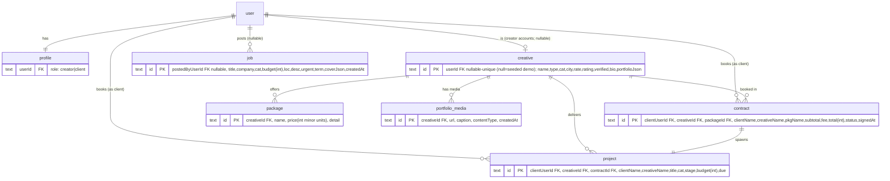

# feat: Wire GRID into a real two-sided marketplace (role, creator profiles, two-party booking, uploads)

## Overview

The GRID dashboard is currently a high-fidelity UI rendered entirely from in-memory seed arrays in `src/lib/grid-data.ts`. Only authentication persists. This plan wires the marketplace to the database so the product stops being a clickable demo and becomes a **genuinely two-sided** marketplace holding real state:

1. **Role persistence** — a user's Creator/Client identity is stored on their `profile` row and read server-side, surviving logout and new devices (replacing the current `localStorage` toggle). Role is fixed at signup.
2. **Real, two-sided creator profiles** — Creatives come from a Drizzle `creative` table. Seeded demo creatives coexist with **real creator accounts**: signing up as a creator creates a linked, editable `creative` row that appears in Browse and is bookable. Jobs read from the DB and **posting a job** writes a real `job` row.
3. **Booking as a real, two-party write** — "Sign & fund escrow" creates `contract` + `project` rows atomically that are visible to **both** the booking client and the booked creator — validating the core marketplace loop.
4. **Portfolio uploads** — files upload to **Cloudflare R2** via presigned URLs; the public URL is stored and rendered on the creator's real, bookable profile.
5. **Editable creator profile** — a creator edits their bio, day rate, and packages; changes appear in Browse and on their public profile.

New accounts start with **honest empty states** (no fabricated history); an optional dev-only seed populates a demo. The work is sequenced data-foundation → role + creator identity → reads → writes (incl. editable profile) → uploads so each layer builds on a stable one beneath it.

## Problem Frame

Beyond Better Auth (`user`/`session`/`account`/`verification`) and a thin `profile` table, there is no persistence. Every marketplace surface reads `grid-data.ts`; every "write" (sign escrow, post job, upload) shows a success state but persists nothing. Role lives only in `localStorage["grid:role"]`, so it does not survive devices and cannot be read on the server — which also blocks server-side role-aware rendering. See `grid-dashboard-architecture` (auto-memory) for the current architecture and intentional placeholders.

## Requirements Trace

- **R1 — Role persists to the profile.** Chosen role is written to `profile.role` at signup, read from the DB on every request, and drives role-aware UI without `localStorage`. (User decision: **role fixed at signup**, topbar toggle removed.)
- **R2 — Browse / creative profile / Jobs / Projects read from the DB.** A seed migration populates demo creatives, packages, and jobs. Browse, `creative/[id]`, the Job Board, and Projects read from Drizzle, not from arrays. The `creative` catalog includes **both** seeded rows and real creator accounts.
- **R3 — Posting a job creates a real job row** that then appears in the Job Board (creator) and in "My jobs" (client, filtered to the poster).
- **R4 — Booking creates contract + project rows** atomically when the client signs & funds escrow; the rows are visible to **both parties** — the client (in their Contracts/Projects) and, when a real creator account was booked, that creator (their inbound booking). This exercises the two-sided loop.
- **R5 — Portfolio uploads store real files** in Cloudflare R2 and render on the creator's real, bookable profile.
- **R6 — A creator can edit their own profile** — bio, day rate, and packages — and the changes appear in Browse and on their public `creative/[id]` page. (User decision: **make the creator side real**, not a read-only catalog.)

Success criteria: a fresh creator signs up, edits their profile, and appears in Browse; a separate client books that creator and both accounts see the resulting contract + project; a client posts a job and sees it; a creator uploads an image that survives a refresh; role sticks across logout. New accounts show honest empty states until they act.

## Scope Boundaries

- **Creatives are real, two-sided** (User decision — "make the creator side real"). The `creative` table holds seeded demo rows (`userId = null`) **and** real creator accounts (`userId` set). A creator signup creates their linked, editable, bookable `creative` row; clients can book it and the creator sees the booking. (Seeded demo creatives have no account, so booking one creates only the client side — they exist to make Browse feel populated.)
- **Honest empty states, not fabricated history** (User decision). New accounts start empty (Projects/Contracts/Jobs) with intentional empty-state copy and fill as they act. No per-account starter seeding. An **optional dev-only seed** (`db:seed --demo`) can populate a demo creator + client + booking for local screenshots.
- **Out-of-scope surfaces stay on mock data**, unchanged: Academy, Shop, Collab, Radar, AI Studio, Community, News, Trends, Saved, Companies/reviews. These continue importing `grid-data.ts`.
- **No payments.** "Fund escrow" records a contract/project; no money moves (no Stripe). Escrow amounts are stored numbers, not real balances.
- **No new tables for** reviews, posts, courses, products, crew, companies — they remain mock. Reviews are still read from mock and spliced onto creative profiles.
- **Notifications and Finance reconciliation are a fast-follow** (not in this plan). The `NOTIFS` list stays mock and the Finance page keeps deriving escrow from mock metrics — so a creator's *inbound booking* is real in Projects/Contracts but the notification of it and the Finance total are not yet. The **dashboard home** (which renders projects + escrow metrics) **is** wired to real per-user data in this plan so the first screen isn't stale after a booking. Reconciling NOTIFS/Finance to real contract sums is the next obvious slice.

## Context & Research

### Relevant code and patterns

- **DB client & schema:** `src/lib/db/index.ts` (libSQL + Drizzle, `DATABASE_URL` → `file:./local.db`), `src/lib/db/schema.ts` (Better Auth tables + existing `profile` table with a `role` text column defaulting to `"creative"`). `drizzle.config.ts`: sqlite dialect, schema `./src/lib/db/schema.ts`, migrations out `./drizzle`. Scripts already exist: `db:generate`, `db:migrate`, `db:push`, `db:studio`.
- **Auth:** `src/lib/auth.ts` (`betterAuth` + drizzle adapter + `nextCookies()`), `src/lib/auth-client.ts` (`signUp`, `signIn`, `useSession`). The dashboard layout `src/app/dashboard/layout.tsx` already calls `auth.api.getSession({ headers: await headers() })` and redirects — the natural place to also load the profile/role.
- **UI seam:** dashboard pages are `"use client"` and import arrays from `grid-data.ts`. The record cards in `src/components/dashboard/cards.tsx` are **pure presentational** (no hooks) — they can render inside Server Components unchanged. `MediaTile` in `src/components/dashboard/ui.tsx` currently renders a CSS gradient from `Tile {title, from, to}`; it needs an optional `url` path to render real images. `ImagePlaceholder` (`src/components/landing/image-placeholder.tsx`) already shows how `next/image` is used with `fill` + `object-cover`.
- **Role today:** `src/components/dashboard/role-context.tsx` (`RoleProvider` seeded `"creator"`, hydrates from `localStorage`, `RoleToggle`); `shell.tsx` renders the toggle in the topbar + mobile drawer; `signup/page.tsx` writes `localStorage["grid:role"]`.
- **Write surfaces to wire:** `src/components/dashboard/sheets.tsx` (`BookingFlow` step machine, `PostJobSheet`, `UploadSheet` — all currently fake their success step).
- **Seed source of truth:** the typed arrays already in `grid-data.ts`. The default catalog seed uses `CREATIVES` (+ their `packages`), `JOBS`, `STAGES`. `PROJECTS`/`CONTRACTS` are **not** part of the default seed (per-user data starts empty) — they only feed the optional `db:seed --demo` fixture. Reusing the same arrays keeps the DB and the still-mock surfaces consistent.

### External references

- **Cloudflare R2 presigned uploads** (confirmed via Context7, `/websites/developers_cloudflare_r2`): `@aws-sdk/client-s3` + `@aws-sdk/s3-request-presigner`; `new S3Client({ region: "auto", endpoint: "https://<ACCOUNT_ID>.r2.cloudflarestorage.com", credentials })`; `getSignedUrl(s3, new PutObjectCommand({ Bucket, Key, ContentType }), { expiresIn })`. Browser does a direct `PUT` to the signed URL. **Two setup prerequisites that are not code:** (a) bucket **CORS** must allow `PUT` from the app origin with the `content-type` header; (b) **public read** must be enabled via the bucket's `r2.dev` URL or a bound custom domain → that base becomes `R2_PUBLIC_BASE_URL`. Unlike Vercel Blob there is **no `onUploadCompleted` server callback**, so the client confirms the upload with a follow-up server action.
- **Next.js 16 data model** (`node_modules/next/dist/docs`): `params`/`searchParams` are Promises; Server Components are the default and the place to fetch; `revalidatePath` + a client `router.refresh()` is the pattern for reflecting Server Action writes. `next/image` needs `images.remotePatterns` for the R2 public host.

### Institutional learnings

- No `docs/solutions/` directory exists yet; no prior learnings to apply. (First plan in this repo.)
- Auto-memory `grid-dashboard-architecture` records the deliberate "mock data + client-side role" placeholders this plan now replaces — keep that memory updated when this lands.

## Key Technical Decisions

- **Role lives on `profile.role`, read in the dashboard layout (not Better Auth `additionalFields`).** Rationale: the user explicitly asked for the "profile table", the column already exists, and a single indexed lookup by `userId` in the layout (already fetching the session) is negligible. `additionalFields` (role in the session object) was the alternative — rejected to honor the request and avoid auth-config churn, though it remains a clean future optimization. Normalize role values to `"creator" | "client"` (the schema currently defaults to `"creative"`); migrate any existing rows.
- **Role is set via a Server Action immediately after signup, and the toggle is removed.** Better Auth auto-creates a session on `signUp.email` and `nextCookies()` syncs it, so a Server Action called right after can identify the user and upsert the profile. `RoleProvider` becomes a read-only context seeded by the server value (kept so existing `useRole()` call sites keep working); `RoleToggle` and the `localStorage` logic are deleted.
- **Server Components fetch; thin Client Components handle interactivity.** Data-backed pages (Browse, `creative/[id]`, Jobs, Projects, Contracts, Profile) convert to Server Components that call query functions and read role server-side. Interactive bits (Browse search/filter, the sheets) move into small `"use client"` children receiving data as props. Cards stay presentational. Rationale: this is the Next 16 idiom, avoids client-side fetch waterfalls, and lets role gate rendering on the server.
- **A creator account *is* a `creative` row.** `creative` gains a nullable, unique `userId`. Seeded demo creatives have `userId = null`; a creator signup creates a linked `creative` row (`userId` set, name from signup, sensible empty defaults to edit). Browse and `creative/[id]` read both. Rationale: the user chose a real two-sided marketplace, so the logged-in creator must be a first-class, bookable, editable listing — not a stand-in.
- **`contract`/`project` are two-party, not single-owner.** Each row carries `clientUserId` (the booking client) + `creativeId` (the booked creative) and snapshots both display names (`clientName`, `creativeName`). Per-user reads (`listProjects`/`listContracts`) return rows where the caller is the client (`clientUserId = me`) **or** the booked creative (`creative.userId = me`); the viewer's role picks the counterparty label. Rationale: a booked real creator must see the same booking the client created — that's the two-sided loop. (Booking a seeded `userId = null` creative simply has no creator side to show.)
- **`package` + `job` are global** (catalog/board). Jobs carry a nullable `postedByUserId` (null = seeded; set = client-posted) so "My jobs" filters to the poster while the Job Board shows all.
- **`portfolio_media` belongs to the `creative` row** (`creativeId` FK), so a creator's uploads render on their real, public, bookable profile. Seeded creatives keep their **gradient** portfolios (JSON on `creative`); real creators build a media portfolio via uploads. Rationale: now that the creator is a real `creative`, media attaches to the listing, not a loose user id.
- **Booking writes `contract` + `project` atomically**, snapshotting package name + price + 10% fee onto the contract (so later profile/package edits don't rewrite history). Rationale: R4 atomicity; avoids a half-booked state; the snapshot matters more now that creators can edit packages.
- **Honest empty states; no per-account starter seeding.** New accounts read real per-user data that starts empty, with intentional empty-state copy, and fills as they post/book/get-booked. A separate, opt-in dev seed (`db:seed --demo`) creates a demo creator + client + one booking for local screenshots. Rationale: the user chose truthful state over a populated-looking demo; this also deletes the per-request `ensureStarterData` race surface entirely.
- **`Tile` gains an optional `url`; `MediaTile` renders an image when present, else the gradient.** Rationale: one rendering primitive serves both seeded gradients and real R2 media; non-breaking for all existing call sites.
- **Mutations are Server Actions that `revalidatePath` the affected routes; sheets call the action then `router.refresh()`.** Rationale: keeps Server-Component pages authoritative and reflects writes without manual cache plumbing.
- **R2 uploads use a presigned upload + a confirm action that trusts only a server-issued key.** A route handler validates session/role and returns a signed upload URL plus an opaque server-generated key; the browser uploads directly; the confirm Server Action receives **only the key** (never a client URL), re-derives the public URL server-side, validates the key belongs to the caller, and inserts the row. Rationale: matches R2's S3 API and avoids body-size limits, while closing the "client confirms an arbitrary/foreign URL" hole (security review CRITICAL #1).

### Decisions added by the confidence-check deepening (security + data-integrity review)

- **Money is stored as integer minor units (cents/øre), never floats.** Compute the 10% fee with integer math; format in the view layer. Rationale: SQLite `REAL` accumulates rounding errors and breaks `subtotal + fee = total` invariants (data review M2).
- **Role is set write-once, atomically with profile creation.** Use a Better Auth `databaseHooks.user.create.after` (or a single transactional signup action) to create the `profile` with the chosen role, instead of a best-effort second round-trip after signup. The write is a true `INSERT … ON CONFLICT(userId) DO UPDATE` and is rejected once a valid role already exists. Rationale: removes the failure window that silently defaults users to `client`, the unique-constraint race, and the "flip my own role after signup" contradiction of R1 (security #7/#8, data M1).
- **The two-row booking write uses an atomic, libSQL-target-safe primitive.** Prefer `db.batch([...])` (single atomic round-trip, works on `file:` and remote Turso) or, if interactive `db.transaction` is used, every statement must run on the `tx` handle. Rationale: interactive transactions behave differently across libSQL targets, and statements issued on the outer `db` silently escape the transaction (data review CRITICAL C1/C2).
- **Foreign keys are enforced and `onDelete` is explicit.** Enable `PRAGMA foreign_keys = ON` on the libSQL client (and in the test harness); user-owned rows (`ownerUserId`/`userId → user`) `CASCADE`, but catalog references (`contract`/`project → creative`/`package`, and `project.contractId`) use `RESTRICT`/`NO ACTION` so re-seeding or catalog edits never rewrite booking history (the contract snapshot is what preserves history). Rationale: SQLite leaves FK enforcement OFF by default, so without the pragma every `onDelete` is inert and the cascade tests pass for the wrong reason (data review H2/H3).
- **CSRF/origin protection is explicit.** The presign `POST` route enforces an Origin/Host allowlist, and Next Server Actions set `serverActions.allowedOrigins`. Rationale: cookie-based sessions make any session-reading `POST` CSRF-able (security #2). The exact Next 16.2.6 config key shapes (`serverActions.allowedOrigins`, `images.remotePatterns`) are verified against `node_modules/next/dist/docs` before coding, per AGENTS.md (feasibility).
- **Authorization, not just authentication, on every per-user seam.** `userId` for every per-user query and mutation (`listProjects`, `listContracts`, `listUserMedia`, `listJobsByPoster`, `createJob`, `createBooking`, `confirmUpload`) is derived **strictly from `auth.api.getSession`** — never from a route param, prop, or client payload — to prevent IDOR (one user reading/mutating another's contracts/escrow/media). Each of Units 3/6/7/8 gets an explicit cross-account IDOR test. Where a write is role-specific (booking is a client action), the action also checks role server-side — UI hiding is not access control (security #1/#2).
- **All client-authored free text is treated uniformly.** Job `title`/`company`/`desc`/`loc` get the same rule as the upload caption: length-capped, validated on insert, rendered as plain text only (never raw HTML). Per-user **rate limiting** covers all authenticated mutations (`createJob`, `createBooking`, presign), not just uploads (security — job posts are shown to all creators, so they're a shared stored-content surface).
- **One role-write path, not two.** Choose the create-time path (Better Auth `user.create.after` hook / a single transactional `signUpWithRole`) OR a standalone `setRoleForCurrentUser` — not both. Maintaining two write entry points for a one-time, security-sensitive event doubles the surface to harden; legacy-row remapping belongs in the Unit 1 migration, not a standing action (scope/adversarial). Note: because this path still touches Better Auth config (a create hook + role-as-input), the original "avoid auth-config churn" argument for `profile.role` over `additionalFields` is weaker than stated — `additionalFields` (role in session, no per-request profile read) remains a reasonable alternative worth a second look before building (adversarial).

## Open Questions

### Resolved During Planning

- **Creatives ↔ accounts?** Real, two-sided (user decision, document-review): seeded demo creatives (`userId = null`) coexist with real creator accounts (a creator signup creates a linked, editable, bookable `creative` row).
- **Starter data vs empty states?** Honest empty states + an opt-in dev seed (user decision, document-review); no per-request `ensureStarterData`.
- **Can users switch role?** No — fixed at signup, toggle removed (user decision).
- **Where does role live?** `profile.role`, read in the layout (honors the request; existing column).
- **Vercel Blob vs R2?** R2 (user direction) — portable, no egress fees; presigned-URL flow.
- **How do Server Actions reflect on Server-Component pages?** `revalidatePath` + `router.refresh()` from the calling client sheet.
- **Whose portfolio do uploads attach to?** The creator's `creative` row (`portfolio_media.creativeId`); shown on their public, bookable profile.

### Deferred to Implementation

- Exact Drizzle column types/defaults and FK `onDelete` behaviors once the migration is generated against the live `local.db`.
- Exact object-key scheme for R2 (random-prefixed, no `userId` — see Unit 8) and collision handling.
- Whether to keep two creative sources transiently (mock array for out-of-scope pages + DB for Browse) or route everything through the query layer — measure drift risk during Unit 5.
- Final empty-state copy wording for Projects/Jobs/Contracts (the states themselves are now in scope).

### Strategic — surfaced by document review

Resolved (user decisions, folded into scope above):

- **Creator-side coherence → make the creator side real.** The logged-in creator gets a real, editable, bookable `creative` profile (Unit 4 creates it, Unit 9 edits it); a client can book a real creator and both see it (Unit 7). This validates the two-sided loop and is the larger of the two options — it expands the plan from one-sided to two-party.
- **Starter seeding → honest empty states.** Per-request `ensureStarterData` is cut; new accounts start empty with intentional copy; an opt-in `db:seed --demo` populates a local demo.

Still open (minor, not blocking):

- **Resequencing for earliest payoff.** Booking is the demo-defining write but sits in Phase 3 after role + reads. Could move to right after the foundation. *Trade-off vs foundation-first; left as-is unless you want the money-moment sooner.*
- **Demo ergonomics of fixed role.** Showing both sides needs two signups. An env-gated, non-production role switch (or the dev seed's pre-made accounts) keeps demos one click away.
- **Reconsider `profile.role` vs Better Auth `additionalFields`** now that the chosen role path touches auth config anyway (create hook + role-as-input). `additionalFields` would also put role in the session, avoiding the per-request profile read. Worth a second look at implementation start.

## High-Level Technical Design

> *This illustrates the intended approach and is directional guidance for review, not implementation specification. The implementing agent should treat it as context, not code to reproduce.*

**Data model (new tables in bold; `user`/`profile` exist):**



> Per-user reads return rows where `clientUserId = me` **or** the row's `creative.userId = me` (booked creator). A seeded creative (`userId = null`) can be booked by a client but has no creator side to show.

**Booking write (R4) — client signs, server commits both rows atomically:**

```mermaid
sequenceDiagram
  participant U as Client (browser)
  participant BF as BookingFlow (client sheet)
  participant SA as createBooking (server action)
  participant DB as Drizzle/libSQL
  U->>BF: Sign & fund escrow
  BF->>SA: createBooking(creativeId, packageId)
  SA->>DB: tx { insert contract; insert project(contractId) }
  DB-->>SA: ids
  SA->>SA: revalidatePath(/dashboard/contracts, /dashboard/projects)
  SA-->>BF: { ok, contractId }
  BF->>U: show "signed" step; router.refresh()
```

**Upload write (R5) — presigned PUT then confirm:**

```mermaid
sequenceDiagram
  participant U as Creator (browser)
  participant US as UploadSheet (client)
  participant API as /api/portfolio/presign (route)
  participant R2 as Cloudflare R2
  participant CA as confirmUpload (server action)
  US->>API: POST { filename, contentType }  (session+role validated)
  API-->>US: { presignedPutUrl, key, publicUrl }
  US->>R2: PUT file (direct, CORS-allowed)
  R2-->>US: 200
  US->>CA: confirmUpload({ publicUrl, caption })
  CA->>CA: insert portfolio_media; revalidatePath(/dashboard/profile)
```

## Implementation Units

- [ ] **Unit 0: Test harness (prerequisite)**

**Goal:** Add a runnable unit-test setup so the logic-bearing units below have a home.

**Requirements:** Enables verifiable R1–R5.

**Dependencies:** None.

**Files:**
- Modify: `package.json` (add `vitest` devDep + `test` script)
- Create: `vitest.config.ts`
- Create: `src/lib/db/test-helpers.ts` (in-memory/temp libSQL `file::memory:` client + apply schema)

**Approach:** Vitest with a throwaway libSQL database per suite (`file::memory:?cache=shared` or a temp file) so query/mutation tests run against real SQL, not mocks. **The test client must enable `PRAGMA foreign_keys = ON`** (same as production, see Unit 1) so cascade/RESTRICT behavior is actually exercised rather than silently ignored. No React component testing in this plan — UI units verify manually.

**Patterns to follow:** Existing `src/lib/db/index.ts` client construction; reuse `schema` for the test DB.

**Test scenarios:**
- Integration: a temp DB can be created, migrated, seeded, and torn down between tests.

**Verification:** `npm test` runs an example DB-backed test green.

---

- [ ] **Unit 1: Schema + migration for catalog, board, and per-user tables**

**Goal:** Add the Drizzle tables (two-party + creator-account model) and normalize `profile.role`.

**Requirements:** R1, R2, R3, R4, R5, R6.

**Dependencies:** Unit 0 (for tests).

**Files:**
- Modify: `src/lib/db/schema.ts` (add `creative`, `package`, `job`, `project`, `contract`, `portfolioMedia`; migrate `profile.role`; register in the exported `schema` map)
- Modify: `src/lib/db/index.ts` (enable `PRAGMA foreign_keys = ON` — via `?foreign_keys=on` on the libSQL URL or a pragma at client creation)
- Create: `drizzle/<generated>.sql` (via `db:generate`)
- Modify: `src/lib/grid-data.ts` (add optional `url?: string` to the `Tile` type)
- Test: `src/lib/db/__tests__/schema.test.ts`

**Approach:** Mirror the existing seed shapes. `creative` stores scalar fields plus a JSON `portfolio` column (seeded gradient tiles) **and a nullable, unique `userId`** linking real creator accounts. Packages move to their own table so a booking can reference a `packageId`. `job.coverJson` holds the gradient `Tile`. `contract`/`project` are **two-party** (`clientUserId` + `creativeId` + `contractId`, snapshotting `clientName`/`creativeName`/package amounts). `portfolio_media` references `creativeId`. Keep ids as text (matches Better Auth convention) with deterministic ids for seeded rows.

**Hardening (from review — apply in this unit):**
- **Money as integer minor units** (cents/øre) in `integer` columns, never `real`/float (data M2).
- **Enforce FKs + explicit `onDelete`:** the client pragma above turns FK enforcement on (off by default in SQLite). `creative.userId → user`, `job.postedByUserId → user`, `contract/project.clientUserId → user` = `CASCADE` (delete the account, delete its owned rows / null its creative link as appropriate); `contract`/`project → creative`/`package` and `project.contractId` = `RESTRICT`/`NO ACTION` so profile/package edits or re-seeds never rewrite booking history (the snapshot preserves it) (data H2/H3). Decide `creative` deletion behavior when a creator account is removed (cascade the listing vs. soft-retain for history).
- **Indexes** on every filter/join key: `creative.userId` (unique), `package.creativeId`, `portfolio_media.creativeId`, `job.postedByUserId`, `contract.clientUserId`, `contract.creativeId`, `project.clientUserId`, `project.creativeId` (data M3 — the two-party reads filter on both client and creative).
- **`project.stage`** defaults to `0`; valid range 0..`STAGES.length-1` enforced at the app layer (SQLite has no enum/check by default) (data M4).
- **Timestamps** stored as epoch `integer({mode:"timestamp"})` like the Better Auth tables — never the display strings used in the mock seed (`"Jun 4"`, `"Delivered"`); format in the view layer (data M4).
- **`profile.role` migration is deliberate, not implicit:** the current column is `NOT NULL DEFAULT 'creative'`. Define the full value map BEFORE generating the migration — decide explicitly whether legacy `'creative'` rows (the old default, so *every* pre-existing profile) become `creator` or `client`; map `'crew'` and any NULL/empty; set the new default to `'client'`; review the generated SQL (changing a SQLite column default is a table-rebuild) to confirm NOT NULL + backfill are preserved (data H4). **drizzle-kit emits DDL only — the value-remap is a hand-authored `UPDATE` appended to the generated migration (or a dedicated numbered migration), with its order relative to the default change stated** (feasibility).
- **`package` rows expose a stable `id`** (the deterministic `{creativeId}:{slug(name)}`); the view-model `Package` type gains that `id` so the booking UI can send a real `packageId` (feasibility — see Unit 7).
- **`project`/`contract` snapshot both party names** (`clientName`, `creativeName`) so each viewer sees the right counterparty for the `withName` the view types render: a client sees the creative's name, a booked creator sees the client's name. (Resolves the adversarial finding that the single-owner model couldn't fill `withName` for the creator side.)
- **`creative.userId` is nullable + unique:** null for seeded demo rows, set for real creator accounts (one creative per creator). The Unit 4 signup hook creates the row.
- **Enable FKs via an explicit `client.execute("PRAGMA foreign_keys = ON")` at client creation**, not a URL query param — libSQL honors the URL form inconsistently across `file:` vs `libsql:` targets, so the explicit form is the portable choice (feasibility).

**Patterns to follow:** Existing `sqliteTable` definitions and the `schema` export in `schema.ts`.

**Test scenarios:**
- Happy path: inserting a `creative` with packages and reading them back returns the expected shape; money columns are integers.
- Edge case: the role value-map converts every legacy value (`creative`, `crew`, NULL/empty) to the chosen `creator|client` per the documented table, and rejects anything outside `{creator,client}` at the app layer.
- Integration: with `PRAGMA foreign_keys = ON`, cascade delete of a `user` removes their `project`/`contract`/`portfolio_media` rows.
- Integration (RESTRICT): deleting/replacing a seeded `creative` or `package` that a `contract`/`project` references is blocked (history is preserved by the snapshot, not cascaded away).
- Edge case: with the pragma OFF the cascade test would silently not delete — assert the pragma is actually applied by the client/harness.

**Verification:** `db:generate` produces a migration; applying it to a fresh `local.db` yields the new tables; schema test passes.

---

- [ ] **Unit 2: Seed script for the catalog + board**

**Goal:** Idempotently populate `creative`, `package`, and seeded `job` rows from existing demo data.

**Requirements:** R2, R3.

**Dependencies:** Unit 1.

**Files:**
- Create: `src/lib/db/seed.ts`
- Modify: `package.json` (add `db:seed`; add `tsx` devDep as the runner)
- Test: `src/lib/db/__tests__/seed.test.ts`

**Approach:** Read the typed arrays from `grid-data.ts` and **upsert** with deterministic ids so re-running neither duplicates nor drifts. Use `onConflictDoUpdate` for mutable catalog fields (price, detail, bio) — `onConflictDoNothing` would silently keep stale catalog data when `grid-data.ts` changes, reintroducing the dual-source drift flagged in Risks (data review M5). `package` rows get deterministic ids (e.g. `{creativeId}:{slug(name)}`) so re-seeding doesn't duplicate them even though creatives don't. Seeded creatives get `userId = null` (demo catalog, not accounts); seeded jobs get `postedByUserId = null`. The script loads env via `dotenv` (already a devDep) and uses the existing `db` client. Real per-user data is **never** seeded by default (honest empty states). An **opt-in `db:seed --demo`** mode additionally creates a demo creator account (with a linked `creative` row) + a demo client + one booking (contract/project) purely for local screenshots — gated behind the flag so production/CI never fabricates user data.

**Patterns to follow:** `src/lib/db/index.ts` for the client; `grid-data.ts` as the data source.

**Test scenarios:**
- Happy path: running seed inserts the 6 creatives + their packages + the seeded jobs.
- Edge case: running seed twice does not duplicate rows (deterministic ids), including packages.
- Edge case: changing a price in `grid-data.ts` and re-seeding updates the existing row (upsert), not a stale no-op.
- Integration: seeded `creative.portfolio` JSON round-trips into the `Tile[]` shape the cards expect.

**Verification:** `npm run db:seed` then `db:studio` shows the catalog; counts are stable across re-runs.

---

- [ ] **Unit 3: Query + view-model layer**

**Goal:** A server-only module that returns data in the exact shapes the cards already consume, plus the `MediaTile` image path.

**Requirements:** R2, R4, R5.

**Dependencies:** Units 1–2.

**Files:**
- Create: `src/lib/db/queries.ts` (`import "server-only"`)
- Modify: `src/components/dashboard/ui.tsx` (`MediaTile` renders `next/image` when `tile.url` is set, else the gradient)
- Modify: `next.config.ts` (`images.remotePatterns` for the R2 public host)
- Test: `src/lib/db/__tests__/queries.test.ts`

**Approach:** Expose read functions — `listCreatives({cat,q})` (seeded + real accounts), `getCreative(id)` (packages, media, reviews-from-mock), `getMyCreative(userId)` (the caller's own listing, for the profile/edit pages), `listJobs()`, `listJobsByPoster(userId)`, `listProjects(userId)`, `listContracts(userId)`, `listCreativeMedia(creativeId)` — each mapping DB rows to the existing TS view types (`Creative`, `Job`, `Project`, `Contract`; `Package` gains `id`). **`listProjects`/`listContracts` are two-party:** return rows where `clientUserId = userId` OR the row's `creative.userId = userId`, and tag each row with the viewer's perspective so the page renders the correct counterparty (`withName`) and labels ("for {client}" vs "with {creative}"). Browse filtering: prefer returning all and filtering in the client child to preserve the instant-filter UX. `MediaTile` change is additive and must not alter any current gradient call site.

**Patterns to follow:** The view types in `grid-data.ts`; `ImagePlaceholder` for the `next/image` `fill`/`object-cover` treatment.

**Test scenarios:**
- Happy path: `listCreatives()` returns seeded creatives **plus** any real creator accounts; `getCreative("john")` includes packages (with ids).
- Edge case: `getCreative("missing")` returns `undefined`/null (drives `notFound()` upstream).
- Edge case: `listProjects(userIdWithNone)` returns `[]` (drives the honest empty state).
- Integration (two-party): a booking made by client A against creator B's account appears in `listProjects(A)` **and** `listProjects(B)`, each tagged with the correct counterparty; it does **not** appear for unrelated user C.
- Integration: a `creative` row's JSON portfolio maps to `Tile[]` with no `url`, while a `portfolio_media` row (by `creativeId`) maps to a `Tile` *with* `url`.

**Verification:** Query tests pass against a seeded temp DB; `MediaTile` renders a gradient with no `url` and an image with one (manual check in Unit 8).

---

- [ ] **Unit 4: Persist role + remove the toggle (R1)**

**Goal:** Role is chosen at signup, stored on `profile`, read server-side, and fixed thereafter — and a creator signup also creates the linked `creative` row.

**Requirements:** R1 (and seeds R6 — the editable profile this creative row enables).

**Dependencies:** Unit 1.

**Files:**
- Create: `src/lib/actions/profile.ts` (`"use server"`: `setRoleForCurrentUser(role)`, `getOrCreateProfile()`)
- Modify: `src/app/(auth)/signup/page.tsx` (after `signUp.email` success, call `setRoleForCurrentUser(role)`; drop `localStorage`)
- Modify: `src/app/dashboard/layout.tsx` (load/create profile, pass `role` to `RoleProvider`)
- Modify: `src/components/dashboard/role-context.tsx` (read-only context seeded by `initial`; remove `localStorage` + `setRole` + `RoleToggle`)
- Modify: `src/components/dashboard/shell.tsx` (remove `RoleToggle` from topbar + drawer; keep the role-derived accents/nav)
- Test: `src/lib/actions/__tests__/profile.test.ts`

**Approach:** Role is created **atomically with the user, write-once**, via a Better Auth `databaseHooks.user.create.after` (role captured at signup as a Better Auth `additionalFields` input, or a single transactional `signUpWithRole` action). The same hook, when `role = "creator"`, also inserts the linked `creative` row (`userId` set, `name` from signup, empty/placeholder type/city/bio/rate, empty portfolio/packages) so the creator immediately appears in Browse and has something to edit (R6). Derive `userId` strictly from `auth.api.getSession` — never from a parameter — and write the profile via a true `INSERT … ON CONFLICT(userId) DO UPDATE` to survive the signup→layout race on the `userId` unique constraint (the `creative` insert is likewise idempotent on its unique `userId`). The layout becomes the single source of role truth. `RoleProvider` keeps its API surface (`useRole().role`) so client pages need no change, but loses mutation. Removing the toggle simplifies `shell.tsx`.

**Execution note:** Implement the role write test-first — it is the security-sensitive seam (reject unauthenticated; never set another user's role; reject a second role change; survive concurrent invocation).

**Patterns to follow:** `auth.api.getSession({ headers: await headers() })` as used in `dashboard/layout.tsx`.

**Test scenarios:**
- Happy path: signup as creator creates exactly one `profile` row with `role = "creator"` **and** exactly one linked `creative` row (`userId` set) that appears in `listCreatives()`; signup as client creates the profile but no creative row.
- Error path: the role write while unauthenticated throws/returns an error and writes nothing.
- Error path: an invalid role value is rejected, never stored raw.
- Error path (write-once): a second role change after one is set is rejected (R1).
- Edge case (race): two near-simultaneous role writes do not violate the `userId` unique constraint (true upsert), producing one row.
- Integration: after signup as client, a fresh server-side `getSession`+profile read returns `role = "client"` (survives a simulated new request with the session cookie); a failed/skipped role step does not leave a silently-wrong default the user can't correct.

**Verification:** Sign up as creator → log out → log back in → dashboard still renders the creator side; no `localStorage` dependency; toggle is gone.

---

- [ ] **Unit 5: Browse + creative profile from the DB (R2)**

**Goal:** Marketplace discovery reads the catalog.

**Requirements:** R2.

**Dependencies:** Units 2–4.

**Files:**
- Modify: `src/app/dashboard/browse/page.tsx` → Server Component fetching `listCreatives()` + role
- Create: `src/app/dashboard/browse/browse-client.tsx` (`"use client"`: search + category filter over props)
- Modify: `src/app/dashboard/creative/[id]/page.tsx` → Server Component (`await params`, `getCreative(id)`, `notFound()` when absent)
- Create: `src/app/dashboard/creative/[id]/creative-profile.tsx` (`"use client"`: booking interactions, receives the creative as a prop)
- Modify: `src/app/dashboard/saved/page.tsx` (resolve saved ids through `getCreative`)
- Test: covered by Unit 3 query tests; pages verified manually.

**Approach:** Move the client-side filter logic out of the page into `browse-client.tsx`, fed by server-fetched data. `creative/[id]` switches from `useParams` to Server-Component `params` + a passed-in data prop; the existing booking UI moves into the client child. Use `notFound()` for unknown ids.

**Patterns to follow:** Next 16 async `params`; the existing Browse filter UX and `CreativeCard`/`PackageRow` usage.

**Test scenarios:**
- (UI/manual) Happy path: Browse lists seeded creatives **and** real creator accounts; category + search filter correctly.
- (UI/manual) Edge case: `/dashboard/creative/unknown` renders the not-found state.
- Integration (query-level, Unit 3): filtering by `cat="Drone"` returns only drone creatives; a newly signed-up creator appears in `listCreatives()`.

**Verification:** Browse and a creative profile render entirely from DB rows; a creator who signs up appears in Browse; removing a row from the DB removes it after refresh.

---

- [ ] **Unit 6: Job board read + post-a-job write (R2, R3)**

**Goal:** Jobs come from the DB and posting creates one.

**Requirements:** R2, R3.

**Dependencies:** Units 3–4.

**Files:**
- Modify: `src/app/dashboard/jobs/page.tsx` → Server Component: creator sees `listJobs()` (urgent + all); client sees `listJobsByPoster(userId)` ("My jobs")
- Create: `src/lib/actions/jobs.ts` (`"use server"`: `createJob(input)` → insert with `postedByUserId = current user`, `revalidatePath("/dashboard/jobs")`)
- Modify: `src/components/dashboard/sheets.tsx` (`PostJobSheet` submits to `createJob`, then `router.refresh()`; keep the success step)
- Test: `src/lib/actions/__tests__/jobs.test.ts`

**Approach:** Server-fetch in the page; the post action takes `userId` from the session (not a param), inserts a real row, and revalidates. `budget` is stored as an integer (minor units, per Unit 1); `title`/`company`/`desc`/`loc` are length-capped, validated on insert, and rendered as plain text only (they're shown to all creators on the board). "My jobs" starts empty for a new client and fills as they post — note this is a visible change from the current mock view that shows all jobs as "My jobs". Job board (creator) shows all open jobs (seeded + posted).

**Execution note:** Start with a failing integration test for `createJob` (auth required → row persisted with the right `postedByUserId`).

**Patterns to follow:** `PostJobSheet`'s existing field set; the `revalidatePath` + `router.refresh()` decision.

**Test scenarios:**
- Happy path: `createJob` inserts a job with `postedByUserId` = caller and the submitted fields.
- Error path: unauthenticated `createJob` writes nothing.
- Edge case: missing/invalid budget or title is rejected before insert.
- Integration: after `createJob`, `listJobsByPoster(userId)` includes it and `listJobs()` shows it on the board.

**Verification:** As a client, post a job → it appears in "My jobs"; switch a creator account → it appears on the Job Board.

---

- [ ] **Unit 7: Projects + Contracts reads + two-party booking write (R2, R4)**

**Goal:** Booking creates real contract + project rows atomically, visible to both the client and the booked creator; both pages read two-party data with honest empty states.

**Requirements:** R2, R4.

**Dependencies:** Units 3–4.

**Files:**
- Modify: `src/app/dashboard/projects/page.tsx` and `src/app/dashboard/contracts/page.tsx` → Server Components reading two-party data; render an **empty state** when the caller has no rows (no starter seeding)
- Modify: `src/app/dashboard/page.tsx` (the **dashboard home** renders `PROJECTS`/`METRICS` from mock — wire its projects + escrow metrics to the two-party queries so the first screen isn't stale after a booking) (product-lens P1)
- Create: `src/lib/actions/booking.ts` (`"use server"`: `createBooking({ creativeId, packageId })` → atomic insert of `contract` + `project`; `clientUserId` from session; revalidate projects/contracts/home)
- Modify: `src/components/dashboard/sheets.tsx` (`BookingFlow` threads `packageId` into `createBooking`, final step calls it, then `router.refresh()`) and `src/components/dashboard/cards.tsx` (`PackageRow.onBook` carries the package id; `ProjectCard`/contract rows use the viewer-tagged counterparty)
- Test: `src/lib/actions/__tests__/booking.test.ts`

**Approach:** `createBooking` loads the creative + package server-side (never trusts client-sent prices), computes the 10% fee in integer math, and writes both rows atomically with `clientUserId` from the session, `creativeId` from the arg, and snapshots of `clientName` (session user) + `creativeName`. **Use `db.batch([...])`** (single atomic round-trip, safe on both `file:` and remote Turso) — or, if interactive `db.transaction` is used, **every statement must run on the `tx` handle**, never the outer `db`, or it silently escapes the transaction (data review C1/C2). The reads are two-party (Unit 3): a booked **real** creator sees the project/contract as an inbound booking — this is the two-sided loop. Booking a seeded (`userId = null`) creative simply has no creator side. **No starter seeding** — when the caller has no rows, the pages show intentional empty-state copy ("No projects yet — book a creative to get started" / creator-side equivalent).

**Execution note:** Test-first on atomicity in **both** directions — assert the contract is absent after a forced failure on the project insert, AND the project is absent after a forced failure on the contract/commit path (the reverse case the obvious test misses).

**Patterns to follow:** `STAGES` for `project.stage`; the contract/total math already shown in `BookingFlow` (subtotal + 10% fee).

**Test scenarios:**
- Happy path: `createBooking` creates one contract + one linked project with server-computed integer totals and both snapshot names.
- Integration (two-sided): client A booking creator B's account makes the rows appear for **both** A (as client) and B (as creative), each with the correct counterparty label.
- Error path: a forced failure on the project insert leaves no contract; a forced failure on the contract/commit leaves no project (both directions).
- Error path: unauthenticated booking writes nothing; unknown `creativeId`/`packageId` is rejected.
- Edge case: price/fee come from the DB package, not the client payload (tampered client price is ignored).
- Edge case (empty state): a brand-new account's Projects/Contracts pages render the empty state, not seeded rows.
- Error path (IDOR): account C (neither client nor creative on the row) cannot read or mutate it — perspective is derived from the session, never a parameter.
- Error path (role gate): a creator-role caller hitting `createBooking` directly is rejected (booking is a client action; UI hiding is not access control).

**Verification:** As a client, book a real creator → both accounts see the contract/project (re-login persists); a brand-new account sees a clean empty state, not fake history.

---

- [ ] **Unit 8: Portfolio uploads to Cloudflare R2 (R5)**

**Goal:** Real file uploads stored in R2 and rendered on the creator's profile.

**Requirements:** R5.

**Dependencies:** Units 1, 3, 4.

**Files:**
- Modify: `package.json` (add `@aws-sdk/client-s3`, `@aws-sdk/s3-request-presigner`)
- Create: `src/lib/r2.ts` (S3 client for R2; key generation; public-URL builder)
- Create: `src/app/api/portfolio/presign/route.ts` (validates session+role, returns presigned PUT URL + key + public URL)
- Create: `src/lib/actions/portfolio.ts` (`"use server"`: `confirmUpload({ key, caption })` → resolve the caller's own `creative` via session, insert `portfolio_media` by `creativeId`; revalidate profile + `creative/[id]`)
- Modify: `src/components/dashboard/sheets.tsx` (`UploadSheet`: request presign → upload to R2 → call `confirmUpload`; progress + error states)
- Modify: `src/app/dashboard/profile/page.tsx` (creator view renders the caller's **real `creative` row** via `getMyCreative(userId)` — their name, type, city, bio, rate, packages, and uploaded media — **dropping the `CREATIVES[0]`/"John Hope" stand-in entirely**. Fields the creator hasn't filled show empty/placeholder prompts that link to the editor; profile editing itself is Unit 9) (adversarial P1)
- Modify: `.env.example` (`R2_ACCOUNT_ID`, `R2_ACCESS_KEY_ID`, `R2_SECRET_ACCESS_KEY`, `R2_BUCKET`, `R2_PUBLIC_BASE_URL`)
- Test: `src/lib/actions/__tests__/portfolio.test.ts`, `src/app/api/portfolio/__tests__/presign.test.ts`

**Approach:** The presign route authorizes the session, generates a key, and returns a short-lived signed upload URL + the opaque key. The browser uploads directly (CORS-permitted), then calls `confirmUpload({ key, caption })`. The profile page renders `portfolio_media` via the `MediaTile` `url` path from Unit 3.

**Hardening (from security review — these are the point of the unit):**
- **`confirmUpload` takes only the server-issued `key`, never a client URL** (security CRITICAL #1 / data L1). It validates the key belongs to the current session user, re-derives the public URL as `${R2_PUBLIC_BASE_URL}/${key}` server-side, and optionally `HeadObject`s the key to confirm the object exists and its stored content-type is allowed before inserting. This blocks hotlinking, foreign-object/foreign-user references, and `javascript:`/`data:` URIs.
- **Key scheme drops the user id from the public path** (security #5): `portfolio/{csprng-random}/{uuid}.{ext}` with a CSPRNG v4 uuid; keep `userId` only in the DB row. Require the R2 bucket's object **listing to be disabled**.
- **Content-type safety on a public bucket** (security #3): exclude `image/svg+xml`; either serve media only through `next/image` (re-encodes) or set `ContentDisposition: attachment`/forced response content-type so the bucket never serves `text/html`/SVG inline.
- **Real size enforcement** (security #4): a presigned `PutObjectCommand` URL cannot cap body size — use a presigned **POST** with a `content-length-range` policy, or bind `ContentLength` in the signed command, plus a bucket/account quota. Do not claim size is enforced by a plain PUT.
- **CSRF/origin** (security #2): the presign `POST` route enforces an Origin/Host allowlist; Next Server Actions set `serverActions.allowedOrigins`.
- **Per-user rate limiting** on presign + write actions (security #10); **caption** length-capped and rendered as plain text only (security #11).
- Setup prerequisites (bucket CORS pinned to exact app origins — never `*`; public read via r2.dev/custom domain; an **R2 lifecycle rule** that auto-expires unconfirmed `portfolio/` objects to bound the orphan/abuse window) are operational — see Documentation / Operational Notes (security #6/#9).

**Execution note:** Test-first on the presign route's authorization (reject unauthenticated; key is server-generated and not forgeable to another namespace; reject disallowed/SVG content types) and on `confirmUpload` rejecting any client-supplied URL.

**Patterns to follow:** Context7 R2 presigned-URL example (`S3Client` `region:"auto"` + account endpoint; `getSignedUrl` + `PutObjectCommand`); `ImagePlaceholder` for `next/image` rendering.

**Test scenarios:**
- Happy path: an authenticated creator gets a presigned upload URL + server-generated key; `confirmUpload({key})` persists a `portfolio_media` row owned by them with the server-derived URL.
- Error path: unauthenticated presign request is rejected (401), writes nothing.
- Error path: a disallowed content type (`application/x-msdownload`, `image/svg+xml`) is refused before signing.
- Error path (CRITICAL): `confirmUpload` rejects a client-supplied URL / a key not owned by the caller — a user cannot insert a foreign or arbitrary URL as their media.
- Edge case: the key is server-generated CSPRNG and cannot be forced to another namespace via client input; it does not embed `userId`.
- Edge case: a cross-origin request to the presign route is rejected (Origin allowlist).
- Integration: after `confirmUpload`, `listUserMedia(userId)` includes the URL and the profile renders it through `MediaTile`.

**Verification:** Upload an image from the device → it stores in R2, survives refresh, and renders on the profile; a second account cannot see the first's pending key.

---

- [ ] **Unit 9: Editable creator profile (R6)**

**Goal:** A creator edits their own `creative` listing — bio, type, city, day rate, and packages — and the changes appear in Browse and on their public `creative/[id]` page.

**Requirements:** R6.

**Dependencies:** Units 1, 3, 4 (the linked `creative` row exists), 8 (media). Lands in Phase 3.

**Files:**
- Create: `src/lib/actions/creative.ts` (`"use server"`: `updateMyCreative(fields)` — scalar profile fields; `upsertPackage(pkg)` / `removePackage(id)` — manage the caller's `package` rows; all scoped to the caller's own `creative` via session)
- Modify: `src/app/dashboard/profile/page.tsx` (add an "Edit profile" affordance for creators) and Create: `src/app/dashboard/profile/edit/page.tsx` + `profile-edit-form.tsx` (`"use client"` form) — or an inline edit sheet, implementer's choice
- Test: `src/lib/actions/__tests__/creative.test.ts`

**Approach:** Each action resolves the caller's `creative` by `creative.userId = session.userId` (never an id from the client) and updates scalar fields or package rows. Money fields are integer minor units (Unit 1). `rate`/`price` are validated (non-negative, capped); free-text (bio/type/city/package detail) is length-capped and stored/rendered as plain text. Editing a package does **not** retroactively change existing contracts (they snapshot — Unit 7). Revalidate `/dashboard/profile` and the public `creative/[id]`.

**Execution note:** Test-first on ownership — a creator can only mutate their own `creative`/packages, derived from the session.

**Patterns to follow:** The booking action's session-scoped ownership; `PackageRow` for rendering; `Field`/form affordances from the auth pages.

**Test scenarios:**
- Happy path: `updateMyCreative` changes bio/rate; the new values show in `getCreative(id)` and `getMyCreative(userId)`.
- Happy path: `upsertPackage`/`removePackage` add/edit/remove the caller's packages; new bookings can reference a newly added package.
- Error path: editing while unauthenticated, or as a client (no creative row), is rejected.
- Error path (IDOR): a creator cannot mutate another creative's profile or packages — target is resolved from the session, not a client id.
- Edge case: negative/oversized rate or over-length bio is rejected before write.
- Integration (history-safe): editing a package's price does not alter the `total` on an already-signed contract that referenced it.

**Verification:** Sign up as a creator → edit bio/rate/add a package → it appears in Browse and on the public profile; an existing booking's contract total is unchanged.

## System-Wide Impact

- **Interaction graph:** `dashboard/layout.tsx` becomes the role entry point for every dashboard route (loads `profile.role`). The signup `user.create.after` hook is the entry point that creates the profile + (for creators) the linked `creative` row. `RoleProvider`'s contract is preserved so all `useRole()` consumers keep working; only its mutation path is removed. Server Actions (`profile`, `creative`, `jobs`, `booking`, `portfolio`) are the write entry points invoked from forms/sheets.
- **Two-party reads:** Projects/Contracts/home each resolve the viewer's perspective from the session (client vs booked creative) — the same row is shown to two accounts with different counterparty labels. This is the highest-value new behavior and the one most prone to a wrong-perspective or leak bug; it carries explicit two-party + IDOR tests.
- **Error propagation:** Server Actions return typed results (ok/error) that the sheets surface inline (reuse the `AuthError`-style affordance). The presign route returns proper HTTP status codes; the upload client distinguishes presign failure vs. R2 PUT failure vs. confirm failure.
- **State lifecycle risks:** Booking is transactional (no half-bookings). R2 has an orphan window — a successful PUT with a failed/abandoned confirm leaves an object with no DB row; mitigate later with an R2 lifecycle rule or a sweep job (noted, not built). `revalidatePath` must target every route a write affects (jobs → board + my-jobs; booking → projects + contracts; upload → profile).
- **API surface parity:** New env vars are consumed by the presign route and `r2.ts`. `next.config.ts` `images.remotePatterns` must include the R2 public host or images 404 through the optimizer.
- **Integration coverage:** The seams unit tests must prove (not mock): signup→profile.role persistence across a new request; booking transaction atomic rollback; presign key scoping to the caller; `createJob` poster attribution.

## Risks & Dependencies

- **R2 setup is partly out-of-code (prerequisite).** Bucket CORS (allow `PUT` + `content-type` from the app origin) and public read (r2.dev or custom domain) must be configured in Cloudflare before uploads work end-to-end. *Mitigation:* document in `.env.example` + a short README/runbook; gate Unit 8 verification on it.
- **Upload trust + abuse (the sharp edges).** A signed upload is a capability and the bucket is public. *Mitigations (Unit 8):* `confirmUpload` trusts only the server-issued key (not a client URL); short `expiresIn`; CSPRNG key without `userId`; bucket listing disabled; SVG/HTML excluded and served via `next/image`/`attachment`; real size cap via presigned POST policy or bound `ContentLength`; CORS pinned to exact origins; R2 lifecycle rule auto-expiring unconfirmed objects; per-user rate limiting.
- **CSRF on session-reading POSTs.** The presign route and Server Actions act on the ambient session cookie. *Mitigation:* Origin/Host allowlist on the route + `serverActions.allowedOrigins`.
- **FK enforcement is OFF by default in SQLite/libSQL.** Without `PRAGMA foreign_keys = ON`, every `onDelete` is inert and cascade tests pass for the wrong reason. *Mitigation:* enable the pragma on the client and in the test harness (Unit 1/0).
- **`profile.role` migration semantics.** The *old* default was `'creative'`, so a naive `'creative'→'creator'` map flips every pre-existing profile to creator — possibly mislabeling clients. *Mitigation:* a deliberate, enumerated value map decided before generating the migration (Unit 1); review the generated table-rebuild SQL; dev DB holds no real data and gets backed up first.
- **Money precision.** Float storage drifts on fee math. *Mitigation:* integer minor units throughout (Unit 1).
- **Server/Client boundary regressions.** Converting pages to Server Components can break if a client-only import leaks server-side. *Mitigation:* keep interactivity in `*-client.tsx` children; `import "server-only"` in `queries.ts`/`r2.ts`; rely on the clean `next build` as the gate (it catches boundary violations tsc misses — proven this session).
- **Two-party access is the riskiest new logic.** A perspective/ownership bug leaks one account's contracts/escrow to another. *Mitigation:* derive perspective strictly from the session; two-party + IDOR tests in Units 3/7/9; `RESTRICT` FKs preserve history.
- **Transitional dual source of creatives** (mock array for out-of-scope pages, DB for Browse) — now sharper because the DB gains real creator accounts + edits the mock array never sees. *Mitigation:* out-of-scope pages stay on mock; DB is source of truth for Browse/profiles; flagged in Open Questions to collapse. Watch cross-references keyed by id/index (e.g. `CREATIVE_REVIEWS.john`, `CREATIVES[0]`) — they assume seeded ids only.
- **Notifications/Finance contradiction (accepted fast-follow).** A real inbound booking shows in a creator's Projects/Contracts, but `NOTIFS` and Finance stay mock, so the notification and escrow total of that booking are not yet real. *Mitigation:* the dashboard home is wired real; NOTIFS/Finance reconciliation is the named next slice.
- **No payments** means "escrow" is cosmetic; do not imply funds move. *Mitigation:* copy already says "held"; keep it.
- **Dependency additions:** `vitest`, `tsx` (dev); `@aws-sdk/client-s3`, `@aws-sdk/s3-request-presigner` (runtime). All compatible with the current Node/Next 16 setup.

## Documentation / Operational Notes

- Add an `R2 setup` section to the README (or `docs/`): create bucket, create S3 API token (access key/secret), set the five `R2_*` env vars, enable public read (r2.dev or custom domain) → `R2_PUBLIC_BASE_URL`. **Security-relevant config:** CORS `AllowedOrigins` pinned to the exact dev + prod origins (never `*`), `AllowedMethods` limited to `PUT`/`GET`; object **listing disabled**; a **lifecycle rule** auto-expiring unconfirmed `portfolio/` objects after ~24h (a Unit 8 setup prerequisite, not a fast-follow — combined with no enforceable PUT size cap it would otherwise be an unbounded storage-abuse surface); ensure the bucket never serves user objects as `text/html`/`image/svg+xml` inline.
- Add `images.remotePatterns` for the R2 public host to `next.config.ts`.
- Note new scripts: `db:seed` (catalog), `test` (vitest). Run order for a fresh clone: `db:push`/`db:migrate` → `db:seed` → `dev`.
- Update the `grid-dashboard-architecture` auto-memory once this lands (role now server-persisted; Browse/Jobs/Projects/Contracts/Profile-media DB-backed; remaining mock surfaces enumerated).

## Phased Delivery

- **Phase 1 — Foundation:** Units 0–3 (harness, schema/migration for the two-party + creator-account model, seed, two-party query layer). Nothing user-visible changes yet; the data layer exists and is tested.
- **Phase 2 — Role + creator identity:** Unit 4 (R1). Role sticks; a creator signup now creates a real, linked `creative` row that appears in Browse.
- **Phase 3 — Reads + writes (both sides go real):** Units 5, 6, 7, 9 (R2, R3, R4, R6). Browse/creative/jobs/projects/contracts go live; posting and two-party booking persist; creators edit their own profile. Creator-visible value lands here, not only at the end.
- **Phase 4 — Uploads:** Unit 8 (R5). Requires the R2 operational setup.

> If the "money moment" should land sooner (see Strategic open questions), Unit 7 (booking) can move ahead of the Browse/Jobs read-conversions (5/6) — it only depends on Units 3–4.

## Sources & References

- Origin: direct user request (no `docs/brainstorms/` requirements doc exists).
- Code: `src/lib/db/{schema,index}.ts`, `drizzle.config.ts`, `src/lib/auth.ts`, `src/app/dashboard/layout.tsx`, `src/components/dashboard/{role-context,shell,sheets,cards,ui}.tsx`, `src/lib/grid-data.ts`, `src/app/(auth)/signup/page.tsx`.
- External: Cloudflare R2 presigned URLs + CORS/public access (Context7 `/websites/developers_cloudflare_r2`); Next.js 16 Server Components, `params`, `revalidatePath`, `images.remotePatterns` (`node_modules/next/dist/docs`); Better Auth `additionalFields`/`inferAdditionalFields` (considered, not chosen).
- Related memory: `grid-dashboard-architecture`, `grid-stack-decisions`, `grid-design-preferences`.
